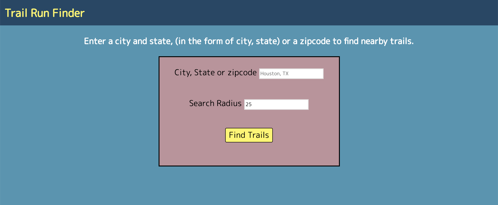

# Trail-Run-Finder

## Live Link (Not Currently hosted)
- [Trail Run Finder](https://shhmavel.github.io/Trail-Run-Finder)

## Summary
The user can enter a location and search radius to return a list of trails that are close by. The location can be entered in many formats including: 
  * City, State 
  * City
  * State
  * Zipcode
  * Point of Interest
  
  For ease and understandibility, the user is simply asked to enter a city and state, or a zipcode.
  The results list displays data on each trail including:
  * Length
  * Conditions
  * Stars (rating)
  * Name
  * Summary
  * Picture (If available)
  
  At the bottom, an interactive Google map is displayed with all of the results listed. The user can then click each result marker and get directions to the trailhead.

## Screenshots:
### Search:

### Results:

### Map:

## Technologies Used
* JavaScript
* HTML
* JQuery
* CSS 
